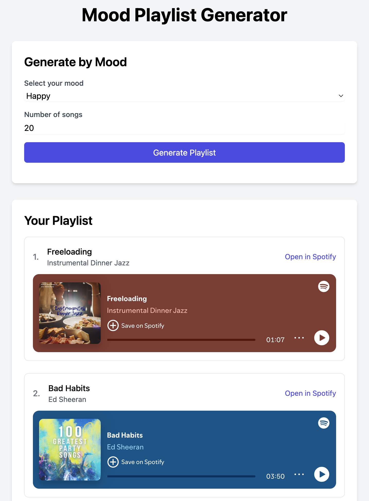

## Mood Playlist Generator

This fun project was built during a hackathon. It generates a playlist based on the mood you select.

### Demo: https://mood-playlist-generator.oussa.workers.dev

### Screenshot:
[](https://mood-playlist-generator.oussa.workers.dev)

This project was created with the `create-honc-app` template.

Learn more about the 🪿 HONC stack on the [website](https://honc.dev) or the main [repo](https://github.com/fiberplane/create-honc-app).

### Getting started
[D1](https://developers.cloudflare.com/d1/) is Cloudflare's serverless SQL database. Running HONC with a D1 database involves two key steps: first, setting up the project locally, and second, deploying it in production. You can spin up your D1 database locally using Wrangler. If you're planning to deploy your application for production use, ensure that you have created a D1 instance in your Cloudflare account.

### Project structure

```#
├── src
│   ├── index.ts # Hono app entry point
│   └── db
│       └── schema.ts # Database schema
├── .dev.vars.example # Example .dev.vars file
├── .prod.vars.example # Example .prod.vars file
├── seed.ts # Optional script to seed the db
├── drizzle.config.ts # Drizzle configuration
├── package.json
├── tsconfig.json # TypeScript configuration
└── wrangler.toml # Cloudflare Workers configuration
```

### Commands for local development

Run the migrations and (optionally) seed the database:

```sh
# this is a convenience script that runs db:touch, db:generate, db:migrate, and db:seed
npm run db:setup
```

Run the development server:

```sh
npm run dev
```

As you iterate on the database schema, you'll need to generate a new migration file and apply it like so:

```sh
npm run db:generate
npm run db:migrate
```

### Commands for deployment

Before deploying your worker to Cloudflare, ensure that you have a running D1 instance on Cloudflare to connect your worker to.

You can create a D1 instance by navigating to the `Workers & Pages` section and selecting `D1 SQL Database.`

Alternatively, you can create a D1 instance using the CLI:

```sh
npx wrangler d1 create <database-name>
```

After creating the database, update the `wrangler.toml` file with the database id.

```toml
[[d1_databases]]
binding = "DB"
database_name = "honc-d1-database"
database_id = "<database-id-you-just-created>"
migrations_dir = "drizzle/migrations"
```

Include the following information in a `.prod.vars` file:

```sh
CLOUDFLARE_D1_TOKEN="" # An API token with D1 edit permissions. You can create API tokens from your Cloudflare profile
CLOUDFLARE_ACCOUNT_ID="" # Find your Account id on the Workers & Pages overview (upper right)
CLOUDFLARE_DATABASE_ID="" # Find the database ID under workers & pages under D1 SQL Database and by selecting the created database
```

If you haven’t generated the latest migration files yet, run:
```shell
npm run db:generate
```

Afterwards, run the migration script for production:
```shell
npm run db:migrate:prod
```

Change the name of the project in `wrangler.toml` to something appropriate for your project:

```toml
name = "my-d1-project"
```

Finally, deploy your worker

```shell 
npm run deploy
```


